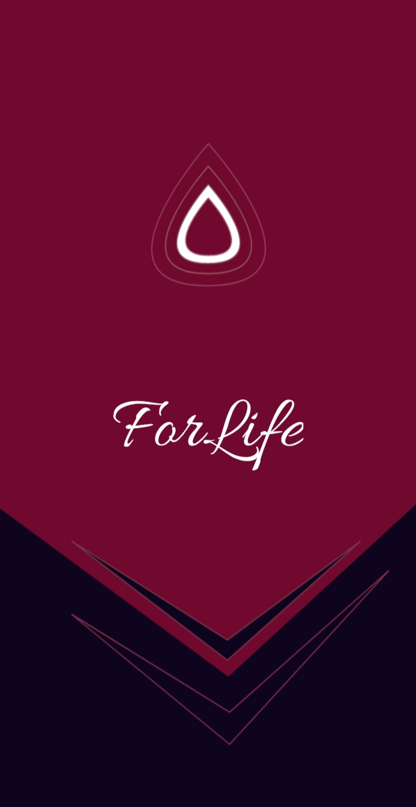

# blood-donor-mobile-application
Mobile app for blood donation in Romania

The mobile application is dedicated to people able to donate blood. However, if some of these people do not know if they are able or not, they will find out from the application, having access to information on this issue. The application allows users to make online reservations at any blood transfusion center in the country (Romania), and they have to go when they are scheduled. At the same time, it sends them notifications with the occurred blood emergencies or provides them information with the visualization of some statistics meant to motivate them to donate. In addition, users have the opportunity to share certain special cases with others so that as many people as possible can find out about them. The apps also provide access to information about donation process or even the opinions of patients who needed blood and were saved through donors. 

<figure>
  
  <figcaption><strong>Fig.1 - Intro Activity.<strong></figcaption>
</figure>

The application was developed using the Android Studio IDE and Java programming language. 
For more details or for a video demonstration, you can write me.

